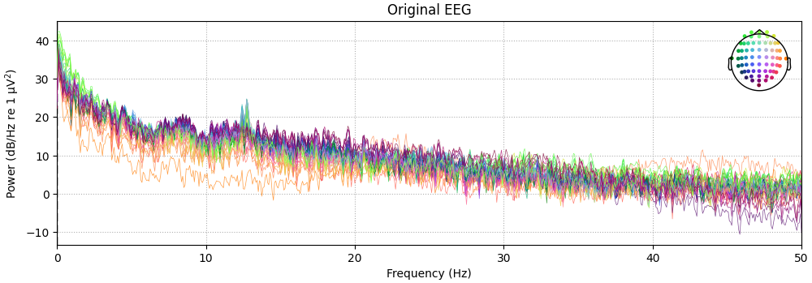
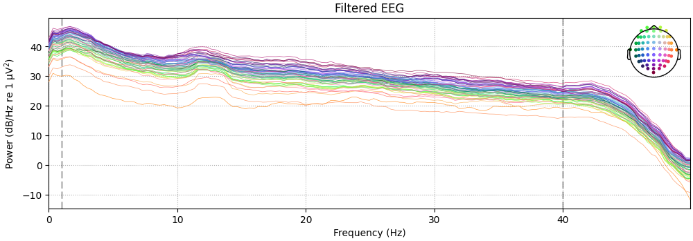

# Total Perspective Vortex

This project aims to develop a Brain-Computer Interface (BCI) using EEG data and machine learning. By analyzing EEG signals within a time window (t₀–tₙ), the system attempts to infer the subject’s thoughts or intended actions—specifically distinguishing between two motions (A or B).

Goals
• Process EEG datas (parsing and filtering)
• Implement a dimensionality reduction algorithm
• Use the pipeline object from scikit-learn
• Classify a data stream in "real time"


## What is EEG

EEG (Electroencephalography) records the brain's electrical activity using electrodes placed on the scalp. It provides high temporal resolution signals, which makes it suitable for BCI tasks where we need to classify intention from short data chunks in near real time. [Full document](machine_learning_service/docs/EEG.md)


[source](https://physionet.org/content/eegmmidb/1.0.0/64_channel_sharbrough.pdf)

## Step 1: File Structure

I created a reusable file structure template for all Machine Learning / Data Science projects. For more details, see the [Document](machine_learning_service/docs/ARCHITECTURE_AND_USAGE.md).

## Step 2: Data

### Dataset Overview

This project uses the [EEG Motor Movement/Imagery Dataset](https://physionet.org/content/eegmmidb/1.0.0/) available on PhysioNet.

The dataset contains EEG recordings collected from **109 subjects** during motor movement and motor imagery experiments. Participants were asked to either **perform or imagine specific movements** (such as moving the left hand, right hand, or feet) while their brain activity was recorded.

The EEG signals were measured using **64 electrodes** placed on the scalp following the standard EEG electrode placement system. The signals represent electrical activity in the brain over time.

Each subject performed several experimental runs where different motor tasks were presented on a screen. During these runs, subjects responded to visual cues by performing or imagining the requested movement.

---

### Data Structure

The dataset is organized by subject and experimental runs.

Example file naming:

```
S001R01.edf
```

Where:

* **S001** → subject identifier
* **R01** → run number

Each subject performed **14 runs**, corresponding to different experimental conditions such as:

* resting state
* real motor movement
* imagined motor movement

The recordings are stored in **EDF (European Data Format)** files, which are commonly used for biomedical signals such as EEG.

---

### Tasks in the Dataset

During the experiment, subjects performed four main types of tasks:

1. Left vs Right hand movement
2. Left vs Right hand motor imagery
3. Both hands vs both feet movement
4. Both hands vs both feet motor imagery

Each EEG recording also includes **event markers (labels)** that indicate when a subject started performing a specific task.

Typical labels include:

* **T0** – rest
* **T1** – first movement type
* **T2** – second movement type

These labels are used as targets for machine learning models.

---

### Conclusion

In summary, the dataset contains EEG recordings from **109 subjects** performing or imagining specific movements. During the experiment, subjects were instructed to execute or imagine actions while their brain activity was recorded through EEG signals.

Using these signals, the objective of the project is to extract meaningful features and train a machine learning model capable of predicting **which action or mental state corresponds to a given EEG signal pattern**.


## Step 3 : Exploratory Data Analysis (EDA)

Objective: verify recordings and detect noise/artifacts before applying preprocessing so feature extraction will be reliable.

What to inspect:

- `info` summary: check `ch_names`, `sfreq`, channel types and any preexisting `bads` or annotations.
- PSD (power spectral density): inspect frequency content (display up to 50 Hz for this dataset) to confirm expected peaks and to locate line-noise or unexpected narrow-band artifacts.
- Raw traces: visually inspect segments to find transient artifacts (eye blinks, muscle activity, electrode jumps) and confirm data quality.
- Montage / channel locations: ensure a standard montage (e.g. `standard_1005`) is assigned so spatial plots and topographies are meaningful and spatial coloring works.

Example `Raw` header printed by MNE (for reference):

```
<RawEDF | S001R06.edf, 64 x 20000 (125.0 s), ~9.8 MiB, data loaded>
<Info | 8 non-empty values
	bads: []
	ch_names: Fc5., Fc3., Fc1., Fcz., Fc2., Fc4., Fc6., C5.., C3.., C1.., ...
	chs: 64 EEG
	custom_ref_applied: False
	highpass: 0.0 Hz
	lowpass: 80.0 Hz
	meas_date: 2009-08-12 16:15:00 UTC
	nchan: 64
	projs: []
	sfreq: 160.0 Hz
	subject_info: <subject_info | his_id: X, sex: 0, last_name: X>
>
```

References and tutorials: https://mne.tools/stable/auto_tutorials/index.html
## Step 4 — Preprocessing

The preprocessing stage prepares raw EEG for feature extraction and modelling. In this project we apply the following steps and explain why each is important:

- Band-pass filtering (1–40 Hz): removes slow drifts (below ~1 Hz) and high-frequency noise above the range of interest, keeping EEG frequencies where motor imagery signals typically appear (theta, alpha, beta bands).
- Notch filtering (50 Hz): removes line noise (power-line interference) present in many recordings.
- Channel renaming / montage: fix channel names and assign a standard montage (e.g. `standard_1005`) so topographic plots and spatial coloring work correctly.
- Independent Component Analysis (ICA): decomposes the signal into components and allows removal of artifact components (eye blinks, cardiac or muscle artifacts) without discarding whole channels or epochs.
- Events extraction: convert annotations into event arrays (e.g. `T0`, `T1`, `T2`) to locate trial onsets for epoching.
- Epoching: cut raw data into trials (epochs) around events (for example tmin=1s to tmax=4s after cue) so features can be computed per trial and labelled for supervised learning.

Why these steps matter:

- Filtering and notch reduce irrelevant noise and make spectral features (e.g. band power) more reliable.
- ICA reduces non-neural artifacts that would otherwise contaminate features or bias a classifier.
- Event/epoch creation structures the data as labelled trials, which is necessary for supervised pipelines (feature extraction + classifier).

The repository includes example PSD plots for the original and filtered data (see images):





