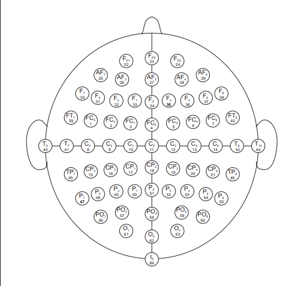
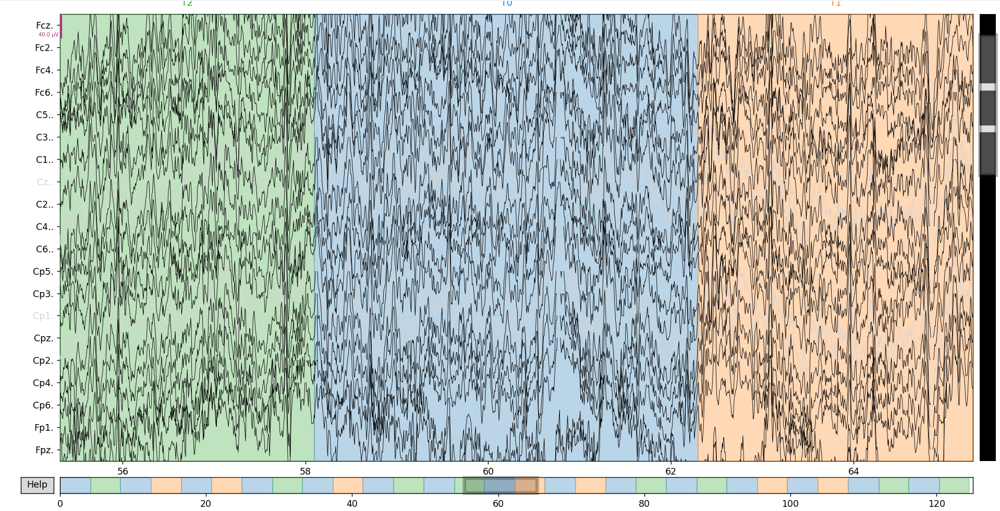

# Total Perspective Vortex

This project aims to develop a Brain-Computer Interface (BCI) using EEG data and machine learning. By analyzing EEG signals within a time window (t₀–tₙ), the system attempts to infer the subject’s thoughts or intended actions—specifically distinguishing between two motions (A or B).

## What is EEG

EEG (Electroencephalography) records the brain's electrical activity using electrodes placed on the scalp. It provides high temporal resolution signals, which makes it suitable for BCI tasks where we need to classify intention from short data chunks in near real time.



## Step 1: File Structure

I created a reusable file structure template for all Machine Learning / Data Science projects. For more details, see the [Document](machine_learning_service/docs/ARCHITECTURE_AND_USAGE.md).

## Step 2: Data

### Dataset Overview

This project uses the [EEG Motor Movement/Imagery Dataset](https://physionet.org/content/eegmmidb/1.0.0/) available on PhysioNet.

The dataset contains EEG recordings collected from **109 subjects** during motor movement and motor imagery experiments. Participants were asked to either **perform or imagine specific movements** (such as moving the left hand, right hand, or feet) while their brain activity was recorded.

The EEG signals were measured using **64 electrodes** placed on the scalp following the standard EEG electrode placement system. The signals represent electrical activity in the brain over time.

Each subject performed several experimental runs where different motor tasks were presented on a screen. During these runs, subjects responded to visual cues by performing or imagining the requested movement.

---

### Data Structure

The dataset is organized by subject and experimental runs.

Example file naming:

```
S001R01.edf
```

Where:

* **S001** → subject identifier
* **R01** → run number

Each subject performed **14 runs**, corresponding to different experimental conditions such as:

* resting state
* real motor movement
* imagined motor movement

The recordings are stored in **EDF (European Data Format)** files, which are commonly used for biomedical signals such as EEG.

---

### Tasks in the Dataset

During the experiment, subjects performed four main types of tasks:

1. Left vs Right hand movement
2. Left vs Right hand motor imagery
3. Both hands vs both feet movement
4. Both hands vs both feet motor imagery

Each EEG recording also includes **event markers (labels)** that indicate when a subject started performing a specific task.

Typical labels include:

* **T0** – rest
* **T1** – first movement type
* **T2** – second movement type

These labels are used as targets for machine learning models.

---

### Conclusion

In summary, the dataset contains EEG recordings from **109 subjects** performing or imagining specific movements. During the experiment, subjects were instructed to execute or imagine actions while their brain activity was recorded through EEG signals.

Using these signals, the objective of the project is to extract meaningful features and train a machine learning model capable of predicting **which action or mental state corresponds to a given EEG signal pattern**.



[source](https://physionet.org/content/eegmmidb/1.0.0/64_channel_sharbrough.pdf)