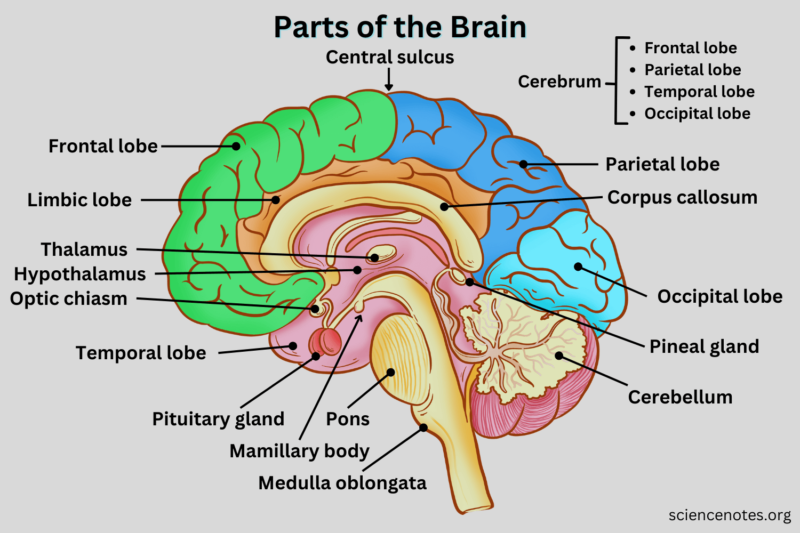
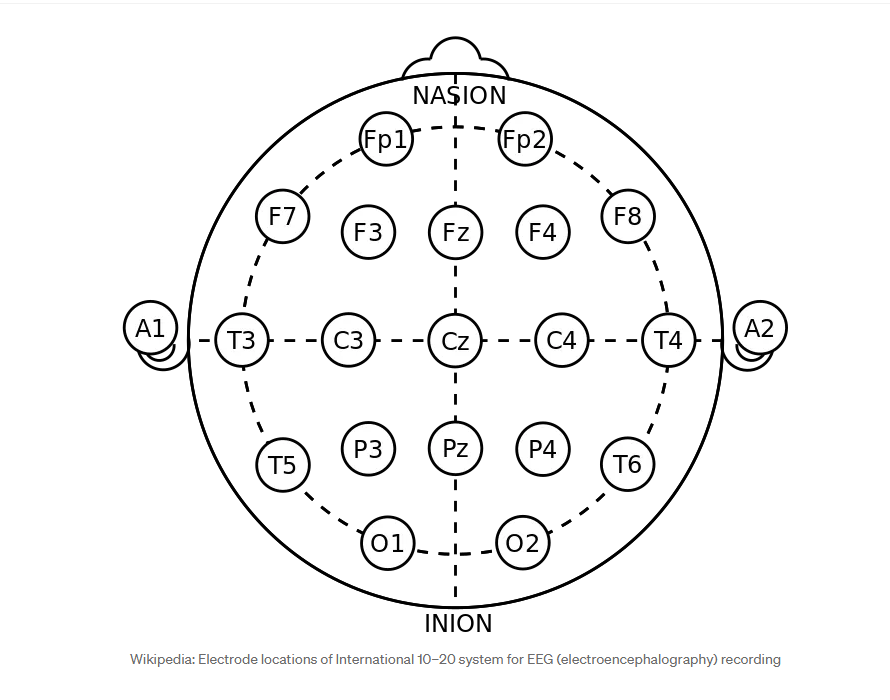
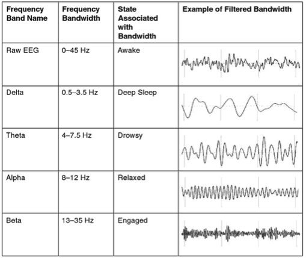

# EEG Nedir?

## 1) EEG'nin Temel Mantığı

EEG, yani Elektroensefalografi, beynin elektriksel aktivitesini kafa derisi üzerinden ölçen bir yöntemdir. Beyindeki nöronlar tek tek çok küçük elektriksel değişimler üretir. Bu değişimler tek başına zayıf görünse de çok sayıda nöron birlikte çalıştığında ölçülebilir bir sinyal oluşur.

EEG cihazı bu sinyalleri elektrotlar aracılığıyla toplar, yükseltir, dijital ortama aktarır ve dalga formu halinde kaydeder. Bu yüzden EEG bize beynin milisaniye düzeyindeki anlık işleyişini gösterir. Yapısal görüntüleme yöntemleri daha çok anatomiyi anlatırken EEG işlevi, yani zaman içindeki beyin aktivitesini öne çıkarır.

## 2) EEG Neden Yapılır?

Klinikte EEG en çok şu sorular için istenir:

- Epileptik aktivite var mı
- Uyku bozukluklarında beyin dalga düzeni nasıl
- Bilinç değişikliği veya nörolojik etkilenme var mı
- Travma, enfeksiyon veya bazı nörolojik hastalıklarda işlevsel bozulma görülüyor mu

Özellikle epilepsi şüphesinde EEG çok değerlidir çünkü anormal elektriksel boşalmaları yakalama şansı verir. Bunun yanında uyku EEG, uzun EEG veya video EEG gibi farklı uygulamalarla klinik soruya göre daha kapsamlı kayıt alınabilir.

## 3) EEG Çekimi Nasıl Yapılır?

Standart EEG'de kafa derisine iletken jel veya macun yardımıyla elektrotlar yerleştirilir. Kayıt sırasında hasta bazen göz açıp kapama, derin nefes alma veya ışık uyarısı gibi komutlar alır. Amaç, beynin farklı koşullara verdiği cevabı da izlemektir.

Rutin çekim çoğu zaman kısa sürer, ancak klinik ihtiyaç varsa kayıt uzatılabilir. Özellikle nöbetlerin uykuda ortaya çıktığı durumlarda daha uzun ya da video eşliğinde çekim tercih edilir.

EEG öncesinde saçın temiz olması, saç ürünlerinin kullanılmaması, kafein ve benzeri etkenlere dikkat edilmesi kayıt kalitesini belirgin şekilde artırır.

## 4) Beyin Bölgeleri ve İşlevleri

Bu görsel EEG yorumunun anatomik temelini anlatır. EEG'de tek başına dalga şekline bakmak yeterli değildir. Aynı zamanda bu dalganın kafa üzerinde hangi bölgeden geldiğini bilmek gerekir. Çünkü her bölgenin baskın işlevi farklıdır.

En basit haliyle şu şekilde düşünebilirsin: EEG cihazı, beynin farklı noktalarından gelen sinyalleri ayrı ayrı kaydeder. Hangi noktada değişim gördüğün, yorumun yönünü belirler.

- **Frontal bölge**: Planlama, dikkat, karar verme, dürtü kontrolü ve davranışın düzenlenmesiyle ilişkilidir.
- **Parietal bölge**: Dokunma duyusu, bedenin uzay içindeki konumu ve duyusal bilgilerin birleştirilmesiyle ilgilidir.
- **Temporal bölge**: İşitsel işlemleme, konuşulan dili anlama, bellek ve duygusal bağlam süreçlerinde önemlidir.
- **Oksipital bölge**: Görsel bilginin işlendiği ana merkezdir.

Bu yüzden EEG yorumunda sadece "anormallik var mı" diye bakılmaz. "Anormallik hangi bölgede" sorusu da sorulur. Örneğin:

- Görsel uyaran verilen bir deneyde oksipital bölgelerdeki ritim değişimi daha anlamlıdır.
- Dikkat ve yürütücü işlev ağırlıklı bir görevde frontal bölgeler öne çıkar.
- İşitsel uyaranlı çalışmalarda temporal bölgelerin cevabı daha çok takip edilir.

Kısacası bu görsel, EEG'nin "beynin haritası üzerinde" nasıl okunduğunu gösterir. Klinik yorumun ilk adımı da budur.

## 5) 10-20 Elektrot Yerleşim Sistemi

Bir sonraki adımda sinyalin güvenilir toplanması gerekir. Bunun için elektrotlar standart bir düzene göre yerleştirilir. En yaygın sistem 10-20 sistemidir.

Bu sistemde:

- Elektrotlar kafa üzerindeki anatomik referans noktaları arasındaki mesafelerin yüzde 10 ve yüzde 20'lik oranlarına göre konumlandırılır.
- Harfler bölgeyi ifade eder: `F` (frontal), `T` (temporal), `C` (central), `P` (parietal), `O` (oksipital).
- Tek sayılar genellikle sol yarıküreyi, çift sayılar sağ yarıküreyi temsil eder.
- `z` eki orta hattaki elektrotları gösterir (örneğin `Fz`, `Cz`, `Pz`).

Bu standart, farklı merkezlerde alınan EEG kayıtlarının karşılaştırılabilir olmasını sağlar. Kaydın kaliteli olması için elektrot teması ve düşük empedans kritik önemdedir.

## 6) Frekans Bantları ve Ne Anlattıkları

Bu görsel EEG'nin en önemli yorum katmanlarından birini gösterir: frekans bantları. EEG kaydı ham halde voltaj-zaman sinyalidir, yani ekranda kıvrımlı bir dalga görürüz. Ancak bu dalganın içinde farklı hızlarda çok sayıda ritim birlikte bulunur.

Bu ritimleri ayırmak için sinyal frekans alanında incelenir. Kaynaklarda da vurgulandığı gibi FFT gibi yöntemlerle "bu dalga hangi frekanslardan oluşuyor" sorusuna cevap aranır. Böylece yalnızca dalganın şekline değil, içeriğine de bakmış oluruz.

### Frekans bantlarını nasıl okumalıyız?

- **Delta (yaklaşık 0.5-4 Hz)**
	Yavaş dalgalardır. Derin uyku dönemlerinde belirgin olur. Uyanık bir kişide beklenmeyen bölgelerde baskınlaşması klinik açıdan dikkat gerektirebilir.

- **Theta (yaklaşık 4-8 Hz)**
	Uykululuk, yorgunluk, bazı bellek ve bilişsel yük süreçleriyle ilişkilidir. Zor bir zihinsel görev sırasında belirli ağlarda artış gösterebilir.

- **Alfa (yaklaşık 8-13 Hz)**
	Rahat uyanıklık ritmi olarak bilinir. Kişi gözlerini kapattığında, özellikle oksipital bölgede alfa gücü artma eğilimindedir. Göz açınca genelde azalır. Bu, EEG'de en sık gözlenen fizyolojik örneklerden biridir.

- **Beta (yaklaşık 13-30 Hz)**
	Dikkat, zihinsel aktivasyon, motor planlama ve uyanıklıkla ilişkilidir. Aktif düşünme veya hareket hazırlığında artabilir.

- **Gamma (yaklaşık 30 Hz ve üzeri)**
	Daha hızlı ritimlerdir. Algısal bütünleme ve üst düzey bilişsel süreçlerle ilişkilendirilir. Yorumlanması daha zordur çünkü kas artefaktları bu bantta karışmaya daha yatkındır.

### Neden bu kadar önemli?

Frekans analizi şunu sağlar:

- Beynin hangi durumda hangi ritmi öne çıkardığını görürüz.
- "Normal patern" ile "beklenmeyen patern" ayrımını daha net yaparız.
- Klinik EEG'de tanıya yardımcı ipuçları elde ederiz.
- Araştırmalarda dikkat, yorgunluk, bilişsel yük gibi metriklere yaklaşırız.

Buradaki en kritik nokta şudur: EEG kaydında tek bir dalga tipi yoktur. Gerçek sinyal, farklı bantların aynı anda üst üste binmiş halidir. Anlamlı yorum, hangi bantın hangi bölgede, hangi görevde ve hangi zamanda değiştiğini birlikte değerlendirince ortaya çıkar.

## 7) Artefaktlar

Kaynaklarda özellikle vurgulanan konu veri temizliğidir. EEG, beyin dışı etkilerden kolayca etkilenir. Bu yüzden iyi analiz, iyi kayıtla başlar.

Başlıca artefaktlar:

- **Kas aktivitesi (EMG)**: Çene sıkma, mimik, boyun kası aktivitesi yüksek frekanslı parazit üretir. 10-20lik sistemde T3, T4, T5, T6 elektrot bölgelerinde yoğunlaşır. 
- **Göz hareketleri (EOG)**: Özellikle frontal kanallarda yalancı yavaş dalga benzeri bozulmalar oluşturur. 10-20lik sistemde frontal kutup elektrotları (Fp1, Fp2) ve frontal hat (F7, F3, Fz, F4, F8) elektrot bölgelerinde yoğunlaşır.
- **Elektrot oynaması ve kötü temas**: Dalgalarda yapay sıçrama ve sürüklenmelere yol açar. 10-20lik sistemde, A1, A2 gibi kulak referansları ve saçlı deride gevşek kalan noktalar hassastır.
- **Hat gürültüsü ve çevresel parazit**: Şebeke kaynaklı veya ortamdan gelen istenmeyen bileşenler ekler. 10-20lik sistemde tüm kanalları etkileyebilir, ama genellikle Cz, Pz gibi merkez hat elektrotlarında daha belirgin görünür.

- **Vücut hareketi**: Kayıtta genel bozulmaya neden olur
kısaca : 
- Frontal kutup (Fp1, Fp2) → göz kırpma ve göz hareketleri
- Temporal (T3, T4, T5, T6) → kas aktivitesi (çene, boyun)
- Kulak referansları (A1, A2) → elektrot oynama
- Merkez hat (Cz, Pz) → hat gürültüsü yayılımı
- Tüm sistem → vücut hareketi

Pratikte deneğin rahat olması, gereksiz hareketten kaçınması, saç ve elektrot hazırlığının doğru yapılması ve kayıt sırasında teknik kontrolün iyi yürütülmesi, analiz kalitesini doğrudan belirler.
[Bu videoda EEG süreci uygulamalı olarak gösteriliyor](https://www.youtube.com/watch?v=_AqTwAoT6dw)

## Kaynaklar

- https://medium.com/@tayyibgondal2003/what-is-eeg-ea9832bd65f7
- https://www.memorial.com.tr/tani-ve-testler/eeg-nedir-eeg-testi-nasil-yapilir
- https://medium.com/@muhammedbuyukkinaci/neuroscience-ve-eeg-analizi-nedir-525ed2204231
- https://biology.stackexchange.com/questions/43508/what-are-wave-frequencies-in-the-eeg
- https://sciencenotes.org/parts-of-the-brain-and-their-functions/